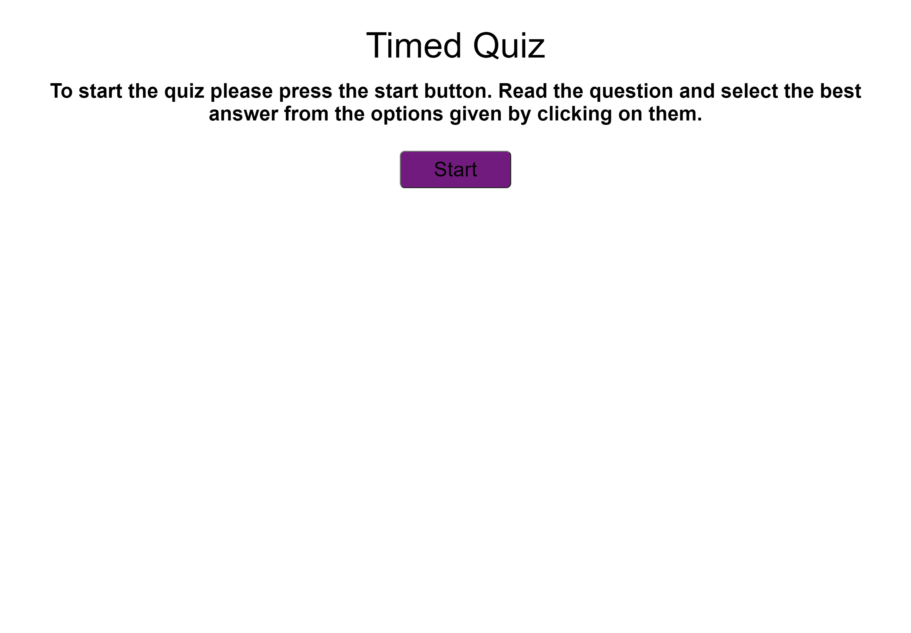

# <Timed Quiz>

## Description

https://dnoon23.github.io/timed-quiz/

This project was to develop a quiz using event listeners to determin what answers were provided by the user.  I also implemented a scoring system that kept track of correct answers given and a timer.  I also used local storage to store these values.  I also implemented a score board so users can input their initials and it posts the initials along with their score and the time remaining to a list by using local storage.  With this users can compare how well they did in various attempts. Towards the end of development I thought of a better way to implement a lot of the page using functions and replacing text, instead of hiding and revealing elements, but I was not able to implement it in time. The ,ost difficult aspect of development of me was being able to store the scores, add them to a list, and make the list carry over on page refresh.

## Installation

To run the program you have to open it in a web browser.

## Usage

After the site is launched, instructions will show up on screen with a button to start the quiz.  Pressing the button to start the quiz will display the first question and present 4 options to choose as an answer.  Selecting an answer will reveal the next question.  This repeats until the quiz is finished or the user runs out of time.  After the quiz is complete the user will be presented with their score and a area to input their initials.  I made it so if nothing is input the page doesn't move on and I also limited the number of characters to 3.  Once the initials are entered the user will be shown the scoreboard that lists pervious scores as well as 2 buttons.  The 'Retry' button bring them back to the starting screen for another attempt and the 'Clear Scores' button deletes the score list.

## Credits

Some code modified from code taken from: 
https://git.bootcampcontent.com/

## Features

If your project has a lot of features, list them here.

